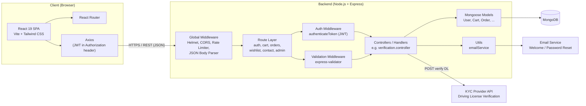
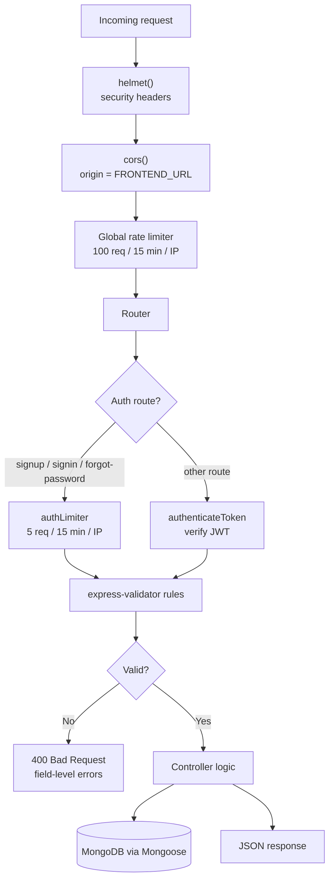
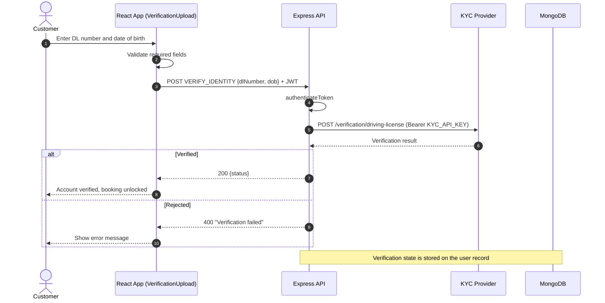

# 🚗 CarCraze

A full-stack web platform for browsing and booking cars, with role-based access for **customers**, **sellers** and **admins**, built as an npm-workspaces monorepo (React + Express + MongoDB).

<!-- TODO: Add a screenshot or demo GIF -->
<!--  -->

---

## 📑 Table of Contents

- [Features](#-features)
- [Tech Stack](#-tech-stack)
- [System Design](#-system-design)
  - [High-Level Architecture](#1-high-level-architecture)
  - [Backend Request Pipeline](#2-backend-request-pipeline)
  - [Identity Verification Flow](#3-identity-verification-flow-driving-license-kyc)
  - [Roles and Access](#4-roles-and-access)
  - [Security Design](#5-security-design)
- [Project Structure](#-project-structure)
- [Getting Started](#-getting-started)
- [Environment Variables](#-environment-variables)
- [Available Scripts](#-available-scripts)
- [API Overview](#-api-overview)
- [Contributing](#-contributing)
- [License](#-license)
- [Author](#-author)

---

## ✨ Features

- **Authentication:** sign up, sign in, logout, profile view/update, forgot/reset password via email
- **Role-based accounts:** `customer`, `seller` and `admin` (admin signup protected by an admin code)
- **Seller business profile:** business info and business phone captured at signup
- **Identity verification:** instant driving-license check through a third-party KYC API before a customer can book
- **Admin verification tools:** review pending verifications and approve/reject sellers
- **Shopping flow:** cart, wishlist and orders
- **Contact form** for support queries
- **Transactional emails:** welcome and password-reset emails
- **Maps:** interactive maps using Leaflet
- **Strong validation:** server-side validation (`express-validator`) and international phone-number input on the client
- **Hardened API:** security headers (Helmet), CORS allow-list, and rate limiting (stricter on auth routes)

---

## 🛠 Tech Stack

| Layer          | Technology                                                                             |
| -------------- | -------------------------------------------------------------------------------------- |
| Frontend       | React 19, Vite 7, React Router 7, Tailwind CSS 4, Axios, React-Leaflet, Font Awesome, `react-phone-number-input` |
| Backend        | Node.js, Express 4                                                                     |
| Database       | MongoDB with Mongoose 8                                                                |
| Auth           | JSON Web Tokens (JWT), Bearer token + credentialed requests                            |
| Security       | Helmet, CORS, `express-rate-limit`, `express-validator`                                |
| External APIs  | Third-party KYC provider (driving-license verification), email service                 |
| Tooling        | npm workspaces, `concurrently`, dotenv                                                 |

---

## 🏗 System Design

### 1. High-Level Architecture



**How it works**

- The **React SPA** (served by Vite in development) talks to the **Express REST API** over JSON. The API base URLs are centralised in `frontend/src/config/api.js`.
- The API is **stateless**: each protected request carries a JWT, which `authenticateToken` verifies before the request reaches a controller.
- **MongoDB** (through Mongoose) is the single source of truth for users, carts, orders, wishlists and contact messages.
- Slow or external work (KYC lookup, sending email) is isolated in a controller or in `utils/`, so the route layer stays thin.

### 2. Backend Request Pipeline



### 3. Identity Verification Flow (Driving License KYC)



> The KYC provider URL in the controller is currently a placeholder (`api.your-kyc-provider.com`). Replace it with your real provider before going live.

### 4. Roles and Access

| Role       | Typical capabilities                                                              |
| ---------- | --------------------------------------------------------------------------------- |
| `customer` | Browse, wishlist, cart, place orders, verify driving license, manage own profile  |
| `seller`   | Everything a user can do, plus business profile; subject to admin verification    |
| `admin`    | Review pending verifications, update verification status, verify sellers          |

### 5. Security Design

| Concern                  | Approach                                                                           |
| ------------------------ | ---------------------------------------------------------------------------------- |
| Brute-force protection   | `authLimiter`: 5 requests / 15 min / IP on signup, signin and forgot-password      |
| General abuse            | Global limiter: 100 requests / 15 min / IP                                         |
| Browser hardening        | `helmet()` sets secure HTTP headers                                                |
| Cross-origin control     | CORS restricted to `FRONTEND_URL` (defaults to `http://localhost:5173`)            |
| Input validation         | `express-validator` for signup, login and profile update; strict international phone format |
| Authentication           | Signed JWTs (`JWT_SECRET`), verified on protected routes                           |
| Privileged signup        | Admin accounts require a server-side `ADMIN_CODE`                                  |
| Secrets                  | Loaded from environment variables via `dotenv`, never committed                    |

### Scaling Notes (future improvements)

- Put the API behind a load balancer and run multiple stateless instances (already JWT-based, so this is straightforward).
- Move the rate limiter store to Redis so limits are shared across instances.
- Add MongoDB indexes for frequently queried fields and consider caching read-heavy listings.
- Move email sending and KYC calls to a background job queue for better resilience and retries.
- Serve the built frontend from a CDN and add centralised logging and monitoring.

---

## 📁 Project Structure

```
CarCraze/
├── backend/
│   ├── package.json
│   └── src/
│       ├── app.js                      # Express app: helmet, CORS, rate limit, route mounting
│       ├── server.js                   # Server entry point (starts the app)
│       ├── controllers/
│       │   └── admin/
│       │       └── verification.controller.js   # Pending verifications, seller and driving-license verification
│       ├── middleware/
│       │   ├── auth.js                 # authenticateToken (JWT verification)
│       │   ├── rateLimiter.js          # authLimiter (5 req / 15 min)
│       │   └── validation.js           # Signup, login and profile-update validators
│       ├── models/
│       │   └── User.js                 # User schema (customer / seller / admin)
│       ├── routes/
│       │   ├── auth.js                 # /api/auth/* endpoints
│       │   ├── cart.js
│       │   ├── orders.js
│       │   ├── wishlist.js
│       │   └── contact.js
│       └── utils/
│           └── emailService.js         # Welcome and password-reset emails
│
├── frontend/
│   ├── package.json
│   ├── index.html
│   └── src/
│       ├── Components/
│       │   ├── LoginDetails/
│       │   │   ├── SignIn.jsx
│       │   │   ├── SignUp.jsx
│       │   │   └── SignUp.css
│       │   └── Customer/
│       │       └── VerificationUpload.jsx       # Driving-license verification form
│       ├── config/
│       │   └── api.js                  # Central API_ENDPOINTS
│       ├── Hooks/
│       │   └── useToast.js             # Toast notifications
│       └── images/                     # Static images (car1, car2, car3, ...)
│
├── debug_user.js                       # Helper script for debugging user data
├── package.json                        # Root workspace config (frontend + backend)
├── package-lock.json
└── .gitignore
```

> Additional models, controllers, pages and components exist beyond those listed above. This tree shows the main files and layout.

---

## 🚀 Getting Started

### Prerequisites

- [Node.js](https://nodejs.org/) v18 or later
- npm v8 or later (workspaces support)
- A MongoDB instance (local or [MongoDB Atlas](https://www.mongodb.com/atlas))
- A KYC provider API key (only needed for driving-license verification)

### Installation

1. **Clone the repository**

   ```bash
   git clone https://github.com/AkshitKumarBansal/CarCraze.git
   cd CarCraze
   ```

2. **Install all dependencies** (root, frontend and backend)

   ```bash
   npm run install:all
   ```

3. **Configure environment variables**

   Create `backend/.env` (see [Environment Variables](#-environment-variables)).

4. **Start the app**

   ```bash
   npm start
   ```

   This runs the Vite dev server (frontend, default `http://localhost:5173`) and the Express server (backend) together.

---

## 🔐 Environment Variables

Create `backend/.env`:

```env
# Server
PORT=5000
NODE_ENV=development
FRONTEND_URL=http://localhost:5173

# Database
MONGODB_URI=mongodb://localhost:27017/carcraze

# Auth
JWT_SECRET=replace_with_a_long_random_string
ADMIN_CODE=replace_with_a_secret_admin_code

# KYC (driving-license verification)
KYC_API_KEY=your_kyc_provider_api_key

# Email (welcome + password reset)
EMAIL_USER=your_email@example.com
EMAIL_PASS=your_email_app_password
```

> ⚠️ Variable names for the database and email settings may differ in the code. Check `backend/src` and adjust to match. Never commit `.env` files.

---

## 📜 Available Scripts

From the repository root:

| Command               | Description                                                        |
| --------------------- | ------------------------------------------------------------------ |
| `npm run install:all` | Install dependencies for the whole workspace                       |
| `npm start`           | Run frontend (`dev`) and backend (`start`) concurrently            |

Run a single workspace:

```bash
npm run dev --workspace=frontend
npm run start --workspace=backend
```

---

## 🔌 API Overview

### Auth (`/api/auth`)

| Method | Endpoint                    | Auth | Description                                        |
| ------ | --------------------------- | ---- | -------------------------------------------------- |
| POST   | `/api/auth/signup`          | No   | Register a customer, seller or admin (rate-limited, validated) |
| POST   | `/api/auth/signin`          | No   | Log in and receive a JWT (rate-limited, validated) |
| POST   | `/api/auth/logout`          | No   | Log out                                            |
| GET    | `/api/auth/profile`         | Yes  | Get the current user's profile                     |
| PUT    | `/api/auth/profile`         | Yes  | Update profile (validated)                         |
| POST   | `/api/auth/forgot-password` | No   | Send a password-reset email (rate-limited)         |

### Other modules

| Module   | Description                                   |
| -------- | --------------------------------------------- |
| Cart     | Manage the user's cart items                  |
| Orders   | Place and view orders                         |
| Wishlist | Save and remove favourite cars                |
| Contact  | Submit a support/contact message              |
| Admin    | Pending verifications, verification status updates, seller verification, driving-license verification |

<!-- TODO: Add exact paths, request bodies and sample responses for cart, orders, wishlist, contact and admin routes. -->

---

## 🤝 Contributing

1. Fork the repository
2. Create a feature branch: `git checkout -b feature/your-feature`
3. Commit your changes: `git commit -m "Add your feature"`
4. Push the branch: `git push origin feature/your-feature`
5. Open a Pull Request

---

## 📄 License

<!-- TODO: Choose a license and add a LICENSE file -->
This project is licensed under the [MIT License](LICENSE).

---

## 👤 Author

**Akshit Kumar Bansal**

- GitHub: [@AkshitKumarBansal](https://github.com/AkshitKumarBansal)